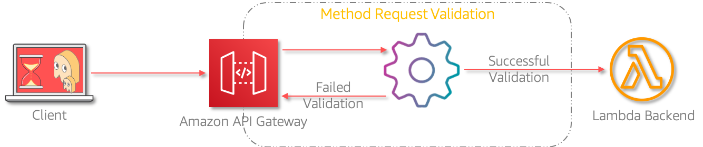

# API Design Best Practice: Input Request Validation

Mystique Unicorn App is a building new microservice. The devs are looking for a way to validate the incoming requests. If possible avoid invoking the backend systems if the requests are invalid. This will have the benefit of reducing cost as well improving the performance of the backend components. The team is looking for your help to achieve this. Can you help them?

## 🎯Solutions

We can use Amazon API Gateway request validation feature to validate incoming requests. Using this feature you can validate request headers, query strings, path parameters and request body. This gives you the flexibility to choose the appropriate validation mechanism for your application.



In this article, we will build an architecture, similar to the one shown above - A simple `stationaries api` with details about stock categories: `pens`, `pencil` and `eraser`. When the incoming request matches any one of these three categories, then the request is fulfilled. If the categories does NOT match, then an invalid request body message is sent back to the requestor.

1.  ## 🧰 Prerequisites

    This demo, instructions, scripts and cloudformation template is designed to be run in `us-east-1`. With few modifications you can try it out in other regions as well(_Not covered here_).

    - 🛠 AWS CLI Installed & Configured - [Get help here](https://youtu.be/TPyyfmQte0U)
    - 🛠 AWS CDK Installed & Configured - [Get help here](https://www.youtube.com/watch?v=MKwxpszw0Rc)
    - 🛠 Python Packages, _Change the below commands to suit your OS, the following is written for amzn linux 2_
      - Python3 - `yum install -y python3`
      - Python Pip - `yum install -y python-pip`
      - Virtualenv - `pip3 install virtualenv`

1.  ## ⚙️ Setting up the environment

    - Get the application code

      ```bash
      git clone https://github.com/miztiik/api-request-validation
      cd api-request-validation
      ```

1.  ## 🚀 Prepare the dev environment to run AWS CDK

    We will cdk to be installed to make our deployments easier. Lets go ahead and install the necessary components.

    ```bash
    # If you DONT have cdk installed
    npm install -g aws-cdk

    # Make sure you in root directory
    python3 -m venv .env
    source .env/bin/activate
    pip3 install -r requirements.txt
    ```

    The very first time you deploy an AWS CDK app into an environment _(account/region)_, you’ll need to install a `bootstrap stack`, Otherwise just go ahead and deploy using `cdk deploy`.

    ```bash
    cdk bootstrap
    cdk ls
    # Follow on screen prompts
    ```

    You should see an output of the available stacks,

    ```bash
    api-request-validation
    ```

1.  ## 🚀 Deploying the application

    Let us walk through each of the stacks,

    - **Stack: api-request-validation**
      This stack creates a simple stationary stock keeping api backend served by a lambda function. To keep it simple, we use a python `dictionary` as data store[ToDo: Try converting this to a DynamoDB table]. Our backend will have three categories: `pens`, `pencil` and `eraser`. In API Gateway we will create a model schema that will validate incoming requests, the schema will look like this,

      ```json
      {
        "$schema": "http://json-schema.org/draft-04/schema#",
        "title": "RequestValidation",
        "type": "object",
        "properties": {
          "category": {
            "type": "string",
            "enum": ["pens", "pencil", "eraser"]
          }
        },
        "required": ["category"]
      }
      ```

      Here you shall observe that we are making `category` required and it should also match one of the `enum` values. Anything request sending other than this will be rejected by the API Gateway.

      Initiate the deployment with the following command,

      ```bash
      cdk deploy efs-stack
      ```

      Check the `Outputs` section of the stack to access the `WellArchitectedApiUrl`.

1.  ## 🔬 Testing the solution

    We can use a tool like `curl` or `Postman` to query the url. The _Outputs_ section of the respective stacks has the required information on the urls.

    ```bash
    $ WAREHOUSE_API_URL="https://syy99dbme4.execute-api.us-east-1.amazonaws.com/miztiik/well-architected-api/get-stationary"
    $ curl -X POST \
           -H 'Content-Type: application/json' \
           -d '{"category":"pens"}' \
           ${WAREHOUSE_API_URL}
    ```

    _Expected Output:_

    ```json
    {
      "message": "[{'sku': 1, 'type': 'gel', 'status': 'available', 'price': 83}]",
      "lambda_version": "$LATEST",
      "ts": "2020-09-15 09:14:51.335417"
    }
    ```

    Now if you change the `category` to anything other than the allowed values, you should be getting your request rejected by API Gateway with a response of `Invalid request body`. [ToDo:]Ofcourse you can customize this response message to suit your needs. You can use `$context.error.validationErrorString` value to get the detailed error message from the gateway and construct your error response<sup>[1],[2],[3]</sup>. For example let us make a request for `bags`

    ```bash
    $ WAREHOUSE_API_URL="https://syy99dbme4.execute-api.us-east-1.amazonaws.com/miztiik/well-architected-api/get-stationary"
    $ curl -X POST \
           -H 'Content-Type: application/json' \
           -d '{"category":"bags"}' \
           ${WAREHOUSE_API_URL}
    ```

    _Expected Output:_

    ```json
    {
      "message": "Invalid request body"
    }
    ```

1.  ## 📒 Conclusion

    Here we have demonstrated how to use API Gateway to validate incoming reqeusts. You can easily require certain headers and/or querystrings by specifying the name of the header or querystring. If you want to validate request body or parameters, you need to define a RequestValidator<sup>[4]</sup>

1.  ## 🧹 CleanUp

    If you want to destroy all the resources created by the stack, Execute the below command to delete the stack, or _you can delete the stack from console as well_

    - Resources created during [Deploying The Application](#deploying-the-application)
    - Delete CloudWatch Lambda LogGroups
    - _Any other custom resources, you have created for this demo_

    ```bash
    # Delete from cdk
    cdk destroy

    # Follow any on-screen prompts

    # Delete the CF Stack, If you used cloudformation to deploy the stack.
    aws cloudformation delete-stack \
      --stack-name "MiztiikAutomationStack" \
      --region "${AWS_REGION}"
    ```

    This is not an exhaustive list, please carry out other necessary steps as maybe applicable to your needs.

## 📌 Who is using this

This repository aims to teach API design best practices to new developers, Solution Architects & Ops Engineers in AWS. Based on that knowledge these Udemy [course #1][103], [course #2][102] helps you build complete architecture in AWS.

### 💡 Help/Suggestions or 🐛 Bugs

Thank you for your interest in contributing to our project. Whether it is a bug report, new feature, correction, or additional documentation or solutions, we greatly value feedback and contributions from our community. [Start here][200]

### 👋 Buy me a coffee

[](https://ko-fi.com/Q5Q41QDGK) Buy me a [coffee ☕][900].

### 📚 References

1. [AWS Docs - RequestValidator][4]

### 🏷️ Metadata

**Level**: 300


[1]: https://marcelog.github.io/articles/aws_api_gateway_return_custom_http_status_codes.html
[2]: https://aws.amazon.com/blogs/compute/error-handling-patterns-in-amazon-api-gateway-and-aws-lambda/
[3]: https://docs.aws.amazon.com/apigateway/latest/developerguide/api-gateway-mapping-template-reference.html
[4]: https://docs.aws.amazon.com/AWSCloudFormation/latest/UserGuide/aws-resource-apigateway-requestvalidator.html
[100]: https://www.udemy.com/course/aws-cloud-security/?referralCode=B7F1B6C78B45ADAF77A9
[101]: https://www.udemy.com/course/aws-cloud-security-proactive-way/?referralCode=71DC542AD4481309A441
[102]: https://www.udemy.com/course/aws-cloud-development-kit-from-beginner-to-professional/?referralCode=E15D7FB64E417C547579
[103]: https://www.udemy.com/course/aws-cloudformation-basics?referralCode=93AD3B1530BC871093D6
[200]: https://github.com/miztiik/api-request-validation/issues
[899]: https://www.udemy.com/user/n-kumar/
[900]: https://ko-fi.com/miztiik
[901]: https://ko-fi.com/Q5Q41QDGK
